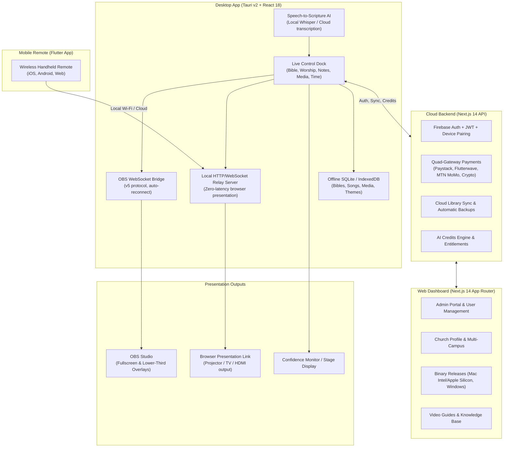

# MakeChurchEasy: Complete Project Assessment & Master Website Content Deck

> **Document Type:** Full System Technical Assessment, Product Positioning, and High-Converting Website Copywriting Deck  
> **Target Audience:** Founders, Marketing AI Agents, Frontend Developers, Copywriters, and Growth Leads  
> **Source Verification:** Verified against the complete repository (`desktop`, `api`, `dashboard`, `makechurcheasy_mobile`, `shared`) — September 2026  

---

## Part 1: Comprehensive System Assessment

### 1. Architectural Overview & Component Map

MakeChurchEasy is an all-in-one church presentation and live-broadcast ecosystem designed specifically for church media teams, solo AV volunteers, and broadcast directors. It bridges the gap between traditional church presentation software (like ProPresenter and EasyWorship) and modern livestreaming software (OBS Studio), while offering browser-based presentation links for churches without OBS.



---

### 2. Component-by-Component Technical Assessment

#### A. Desktop Application (`desktop/`)
* **Core Technology:** Built on **Tauri v2**, **React 18**, **TypeScript**, and **Vite**. 
* **Performance Profile:** Unlike Electron-based competitors that consume 2GB+ RAM, MakeChurchEasy operates at a fraction of CPU and memory usage, critical for church laptops running OBS simultaneously.
* **OBS Studio Integration (`desktop/src/dock/dockObsClient.ts`):** Direct integration via OBS WebSocket v5. Provides one-click creation of browser sources, scene routing, preview/program workflow, and automatic reconnection.
* **Local Presentation Server (`desktop/src/services/presentationDockBridge.ts`):** Embedded local HTTP/WebSocket server. Emits instant HTML/CSS overlays (`mce-bible-overlay.html`, `mce-worship-overlay.html`). Churches without OBS can project directly from any web browser or second display.
* **Scripture Engine (`desktop/src/services/scriptureEngine.ts`):** 100% offline Bible database. Features sub-millisecond reference parsing, keyword search, side-by-side / line-by-line translation comparisons, and customizable broadcast-grade typography (Broadcast Bold outer strokes, drop shadows, safe-area auto-scaling).
* **Worship Lyrics Engine (`desktop/src/worship/`):** Song catalog manager with online search, URL import, AI lyric cleanup, automatic verse/chorus segmentation, and bulk import support for ProPresenter, EasyWorship, and numbered hymnals (e.g., CCC hymns).
* **Speech-to-Scripture AI ("Verse AI"):** Microphone capture engine that analyzes sermon speech in real time using HuggingFace Transformers (local Whisper models) or cloud transcription. Automatically detects referenced verses and stages them for 1-click display or auto-projection.
* **Ministry Graphics Engine:** In-dock creation of animated lower thirds, breaking news tickers, service countdowns, clocks, multiview layouts, and picture-in-picture quick merges.
* **Offline Resilience:** All projection, Bible lookups, song lyrics, and OBS actions run locally without internet. Internet is only required for account sign-in, cloud backups, and AI credit top-ups.

#### B. Cloud API (`api/`)
* **Core Technology:** Next.js 14 API routes, TypeScript, Node.js runtime.
* **Payment Architecture:** Robust **Quad-Gateway** system designed specifically for international and emerging market accessibility:
  1. **Paystack:** Card, Bank Transfer, USSD (Nigeria & West Africa).
  2. **Flutterwave:** Pan-African mobile money & cards.
  3. **MTN MoMo:** Direct telecommunication mobile wallet payments.
  4. **NowPayments:** Cryptocurrency gateway (USDT, BTC, ETH) for unrestricted global subscriptions.
* **Subscription & Entitlement Engine (`shared/subscription/sourceOfTruth.ts`):** Single source of truth managing three canonical plans (`free`, `basic`, `growth`). Handles regional price localization (NGN vs USD), automated grace periods, and monthly AI credit allotments.
* **Device Pairing (`api/src/app/api/pairing/`):** 6-digit numeric pairing codes and QR tokens allowing desktop and mobile controllers to securely handshake with church accounts without typing passwords on media computers.

#### C. Web Dashboard (`dashboard/`)
* **Core Technology:** Next.js 14 App Router, Tailwind CSS, Lucide icons, Dark/Light modes.
* **Public Surfaces:** Landing page, pricing calculator, download center for macOS (Universal DMG) and Windows (x64 NSIS installer).
* **Private Customer Portal:** Church profile customization, team member roles, active session security (2FA), billing and invoice receipts, credit history, device pairing manager, and interactive video tutorials.
* **Admin Center:** Multi-tenant church management, user detail view, discount code generator, global announcements banner engine, software release mirrors, and audit logging.

#### D. Mobile Application (`makechurcheasy_mobile/`)
* **Core Technology:** Flutter (Dart), targeting iOS, Android, and Web.
* **Feature Set:** Pocket-sized church remote. Allows pastors, worship leaders, or roving volunteers to search and push scriptures, advance worship lyrics, switch OBS scenes, and manage ticker messages directly over Wi-Fi.

---

### 3. Website Audit: The Domain Discovery & Landing Page Critique

#### The Domain Conflict: `makechurcheasy.com` vs `makechurcheazy.com`
During our technical audit of the live web properties, we uncovered a critical discovery:
1. **`https://makechurcheasy.com` (spelled with an `s`):**
   - **Status:** **Parked on GoDaddy** (`wsimg.com/parking-lander`).
   - **Risk:** High loss of organic traffic. Users, pastors, and church media operators naturally spell "easy" with an **s**. Anyone typing the URL directly sees a generic domain parking page rather than the product.
2. **`https://makechurcheazy.com` (spelled with a `z`):**
   - **Status:** **Live production website** running the Next.js app.
   - **Action Required:** Point the DNS records (A / CNAME) of `makechurcheasy.com` directly to the production Vercel/server IP, or configure a permanent 301 redirect from `makechurcheasy.com` to `makechurcheazy.com`.

#### Critique of Current Landing Page Copy (`dashboard/app/page.tsx`)
While the current landing page is clean and functional, it underperforms in several key conversion dimensions:
1. **Buries the Breakthrough Feature:** Speech-to-Scripture AI (which automatically listens to the sermon and prepares scriptures without human panic) is hidden in a 6-item feature grid instead of being spotlighted as the hero differentiator.
2. **Lacks Emotional Resonance & Urgency:** Church media volunteers are constantly stressed: pastors quoting unannounced scriptures, volunteers freezing up, and complex software crashing mid-service. The current copy uses passive corporate language ("Built for modern church production") instead of speaking directly to the chaos of Sunday morning.
3. **Weak Competitive Positioning:** Does not directly contrast itself with expensive legacy tools ($399+ ProPresenter licenses, clunky PowerPoint slides, or pirated EasyWorship copies).
4. **Platform Ambiguity:** The primary button defaults to "Download for Mac" on initial hydration, inadvertently causing Windows users to hesitate.
5. **Entitlement Copy Mismatch:** The landing page copy states Basic offers "300 monthly credits" while the canonical source of truth in code allocates 100 credits for Basic and 2,000 for Growth.

---

## Part 2: Master Website Content & Copywriting Deck

*(Use the content below to build the landing page, create feature pages, or feed directly into another AI tool.)*

```
================================================================================
                    MAKECHURCHEASY MASTER COPYWRITING DECK
================================================================================
```

### 1. Brand Positioning & Core Hook

* **Brand Name:** MakeChurchEasy
* **Tagline:** Church presentation made effortless for OBS and the sanctuary.
* **One-Sentence Description:** MakeChurchEasy is an all-in-one church presentation software that connects directly to OBS Studio or any browser display, letting church media teams present scriptures, worship lyrics, media, and lower thirds in seconds—even using AI to detect spoken Bible verses live.
* **Core Value Proposition:** Stop wrestling with clunky presentation software, expensive subscriptions, and frantic scripture searching. MakeChurchEasy gives volunteers a fast, crash-proof dock that delivers broadcast-ready visuals to your church screens and livestream simultaneously.

---

### 2. Website Navigation Structure

* **Logo:** MakeChurchEasy (with flame/cross broadcast icon)
* **Nav Links:**
  * Features (Speech-to-Scripture, Bible Engine, Worship Lyrics, OBS Studio & Presentation Link, Ministry Graphics)
  * How It Works
  * Why Us vs ProPresenter
  * Pricing
  * Tutorials & Support
* **Header CTAs:**
  * Secondary: `Log In`
  * Primary: `Download Free` (Detects macOS vs Windows automatically)

---

### 3. Hero Section (Above the Fold)

#### Badge / Eyebrow:
`✦ VERSION 3.0 IS LIVE: OBS STUDIO & BROWSER PRESENTATION`

#### Main Headline (H1):
# Beautiful Church Presentations in OBS.<br>Zero Panic on Sunday Morning.

#### Supporting Headline / Subtitle:
> Present Bible verses, worship lyrics, lower thirds, countdowns, and media from one clean dock. Connects directly to OBS Studio or any projector screen. Includes Speech-to-Scripture AI that listens to your pastor and brings up verses automatically.

#### Call to Action Group:
* **Primary Button:** `Download Free for Windows & Mac` *(Subtext: Instant download • No credit card required • 14-day full feature trial)*
* **Secondary Button:** `Watch 2-Minute Demo` *(Triggers interactive product walkthrough modal)*

#### Trust Badges / Social Proof Ribbon:
* ✓ **100% Offline Capable** — Runs completely without internet on Sunday
* ✓ **Native OBS Studio Integration** — One-click overlays and scene routing
* ✓ **Zero-Lag Volunteer Dock** — Anyone can learn it in 5 minutes
* ✓ **Affordable Church Pricing** — Starting at free, paid plans from just ₦3,500 / $4/mo

#### Hero Visual & Caption:
* **Visual Asset:** High-resolution mockup of MakeChurchEasy Live Dock showing a live scripture comparison (Romans 8:28 KJV vs NIV) with broadcast-bold styling, side-by-side with the live OBS preview window showing clean lower thirds over camera footage.
* **Caption:** *One click sends broadcast-ready graphics to your sanctuary projector and your online livestream.*

---

### 4. The Problem / Pain Agitation Section

#### Section Header:
### THE SUNDAY MORNING MEDIA STRUGGLE
## Church AV Shouldn't Feel Like Defusing a Bomb

#### The 4 Frustrations Every Media Team Knows:

1. **The "Frantic Scripture Search" Panic**
   * *The Nightmare:* The pastor goes off-script and quotes 1 Peter 3:15 without warning. Your media volunteer is sweating, typing furiously, searching through three dropdowns, and finally pushes the verse just as the pastor moves on.
   * *The MakeChurchEasy Fix:* Instant keyboard search pulls up any reference in 200ms. Or better yet: our Speech-to-Scripture AI listens to the pastor's microphone and queues the scripture on your screen before you even finish typing.

2. **The Clunky, Overpriced $400 Software Trap**
   * *The Nightmare:* Legacy church presentation tools cost hundreds of dollars per year, demand high-end gaming laptops, and crash right before praise and worship begins.
   * *The MakeChurchEasy Fix:* Built on Tauri v2 for featherweight, native speed. Runs smoothly on modest church computers with zero bloat and reasonable plans designed for every church budget.

3. **The OBS Browser Source Headache**
   * *The Nightmare:* Trying to hack together Bible overlays with complicated browser source plugins, broken HTML links, and misaligned text scaling that clips outside the screen.
   * *The MakeChurchEasy Fix:* Native bidirectional OBS WebSocket connection. Push fullscreen slides, lower thirds, tickers, and countdowns into your existing OBS scenes with zero manual browser resizing.

4. **Volunteer Burnout & Training Friction**
   * *The Nightmare:* Only one person in the entire church knows how to operate the presentation computer. If they get sick, the church has no lyrics on Sunday.
   * *The MakeChurchEasy Fix:* An intuitive, distraction-free dock interface that a teenager or first-time volunteer can master in 5 minutes.

---

### 5. Deep-Dive Feature Showcase

---

#### Feature 1: Speech-to-Scripture AI (The Secret Weapon)
* **Tag:** `WORLD'S FIRST REAL-TIME SCRIPTURE LISTENER`
* **Headline:** The Pastor Preaches. The Scripture Appears. Automatically.
* **Body Copy:**
  Imagine a Sunday service where your media team never scrambles to find a scripture again. 
  MakeChurchEasy listens to the sermon audio through your microphone feed. As soon as the pastor says, *"Let's turn together to Jeremiah 29 verse 11,"* the AI detects the reference, retrieves the exact passage from your offline Bible library, and displays it on your operator preview screen.
* **Key Capabilities:**
  * **Operator Assist Mode:** Review detected verses on your preview monitor and tap `Send Live` with one key.
  * **Hands-Free Auto-Push:** Let the AI project verses automatically during fast-paced sermons.
  * **Works Offline:** Powered by local Whisper AI transformers—no expensive internet connection required during service.
  * **Sermon Summaries & Transcripts:** Turn recorded sermons into downloadable PDF/DOCX study notes, summaries, and transcripts with a single click.

---

#### Feature 2: High-Velocity Bible Engine & Broadcast Typography
* **Tag:** `SCRIPTURE PRESENTATION`
* **Headline:** Sub-Millisecond Search. Broadcast-Bold Styling. Multi-Version Compare.
* **Body Copy:**
  Present scripture the way broadcast networks present graphics. With installed offline versions (KJV, NIV, ESV, NKJV, NLT, and more), search by reference or spoken phrase in milliseconds.
* **Key Capabilities:**
  * **Broadcast Bold Styling:** Engineered outer stroke outlines (`paint-order: stroke fill`) and deep drop shadows ensure text remains razor-sharp and legible over any background image, motion video, or live camera feed.
  * **Side-by-Side Translation Compare:** Display two Bible versions simultaneously (e.g., KJV vs Amplified) in side-by-side or line-by-line layouts.
  * **Dual Output Modes:** Toggle seamlessly between Fullscreen sanctuary slides and lower thirds for your livestream.
  * **Smart Auto-Scaling:** Text dynamically adjusts to fit safe 16:9 screen boundaries without awkward line truncations or overflow clipping.

---

#### Feature 3: Worship Lyrics with 1-Click Hymnal Import
* **Tag:** `PRAISE & WORSHIP`
* **Headline:** Fast Song Prep. Automatic Slide Splitting. Ready for Worship.
* **Body Copy:**
  Building worship setlists shouldn't take hours on Saturday night. Search your offline library, look up lyrics online, or paste raw text—our intelligent engine formats verses, choruses, and bridges automatically.
* **Key Capabilities:**
  * **Intelligent Slide Splitting:** Pastes an entire song and splits it cleanly into 2-line or 4-line slides with proper musical cadence.
  * **Hymnal Support:** Built-in numbered hymnal structures (including CCC Hymns, Anglican, and Catholic hymnals) for instant numerical search during liturgy.
  * **1-Click EasyWorship & ProPresenter Migration:** Import your church's existing song library without typing lyrics from scratch.
  * **Live Lyrics Lower Thirds:** Display lyrics across the bottom of the video stream while keeping camera angles unobscured.

---

#### Feature 4: Native OBS Studio Integration & Browser Presentation Links
* **Tag:** `DUAL BROADCAST WORKFLOW`
* **Headline:** Got OBS? Connect in 1 Click. No OBS? Project in Any Browser.
* **Body Copy:**
  Whether your church broadcasts with a multi-camera OBS Studio rig or simply connects an HDMI cable to a TV projector, MakeChurchEasy works out of the box.
* **Key Capabilities:**
  * **OBS Studio Dock:** Dock MakeChurchEasy directly inside OBS Studio or run it as a standalone floating application.
  * **Scene Routing:** Automatically route Bible verses to your Scripture Scene, lower thirds to your Camera Scene, and lyrics to your Worship Scene without touching OBS scene buttons.
  * **Browser Presentation Link:** Open a local URL (`http://192.168...`) on any laptop, tablet, or smart TV on the church Wi-Fi. What you click on the dock updates the screen with zero delay.
  * **Stage & Confidence Monitor:** Show upcoming slides and speaker countdowns to the worship team on stage.

---

#### Feature 5: Ministry Graphics (Lower Thirds, Tickers & Countdowns)
* **Tag:** `FULL PRODUCTION SUITE`
* **Headline:** Everything Needed to Brand Your Church Livestream.
* **Body Copy:**
  Replace dozens of disparate plugins and Photoshop templates with unified broadcast modules built right into your presentation dock.
* **Key Capabilities:**
  * **Speaker Lower Thirds:** Display pastor names, guest speaker titles, and sermon series topics with elegant motion graphics.
  * **Live Ticker Banners:** Run scrolling announcements, welcome messages, offering bank details, and event dates across the bottom of the screen.
  * **Service Countdowns & Clocks:** Keep services on time with pre-service countdown timers, sermon time limits, and live stage clocks.
  * **Multi-View & Quick Merge:** Compose picture-in-picture layouts combining camera video, scripture text, and slides in real time.

---

#### Feature 6: Mobile Remote Control
* **Tag:** `FREEDOM FROM THE MEDIA DESK`
* **Headline:** Control the Sanctuary from the Palm of Your Hand.
* **Body Copy:**
  Give your pastor, worship leader, or floor director the power to advance slides from anywhere in the auditorium using the MakeChurchEasy mobile app.
* **Key Capabilities:**
  * **Instant QR Code Pairing:** Scan the screen with iOS or Android to connect securely—no passwords or network configurations needed.
  * **Low-Latency Switching:** Tap to trigger the next lyric, jump to a scripture, or blackout the screens.
  * **Stage Notes:** View speaker notes and countdown timers directly on personal tablets.

---

### 6. How It Works (The 3-Step Setup)

```
[ STEP 1: DOWNLOAD & LAUNCH ]
Download MakeChurchEasy for Mac or Windows. It installs in 30 seconds with no complex database configurations.

[ STEP 2: CONNECT OUTPUT ]
Connect to OBS Studio via WebSocket with one click, or open your local Presentation Link in any browser.

[ STEP 3: PRESENT WITH CONFIDENCE ]
Search scriptures, trigger lyrics, launch countdowns, or let Speech-to-Scripture AI handle the verses.
```

---

### 7. Competitive Comparison Table

| Feature / Capability | MakeChurchEasy | ProPresenter | EasyWorship | PowerPoint / Canva |
| :--- | :---: | :---: | :---: | :---: |
| **Price** | **Free tier / From ₦3,500 ($4)/mo** | $399+ license / $25+/mo | $18+/mo | $0 / Office sub |
| **Speech-to-Scripture AI** | **Yes (Real-Time Voice)** | No | No | No |
| **Native OBS WebSocket Integration** | **Yes (Built-in)** | Plugin/NDI required | Complex NDI setup | Window capture hack |
| **Browser Presentation Link (No OBS)** | **Yes (Instant local URL)** | No | No | No |
| **Lightweight Memory Usage** | **< 200MB RAM (Tauri v2)** | 1.5GB – 4GB+ RAM | 1GB – 2GB RAM | Variable |
| **Offline-First Resilience** | **100% Offline Sunday Mode** | Yes | Yes | Partial |
| **Broadcast Bold Text Engine** | **Built-in Outline & Shadow** | Manual styling | Basic shadow | Hard to read on camera |
| **Multi-Translation Compare** | **1-Click Side-by-Side** | Complex multi-box | Limited | Manual copy-paste |
| **African & Global Payment Gateways** | **Paystack, MoMo, Crypto, Cards** | US Card only | US Card only | US Card only |
| **Volunteer Learning Curve** | **5 Minutes** | Days/Weeks | Hours | Easy but limited |

---

### 8. Target Audience Personas

#### Persona 1: The Stressed Church Volunteer (AV Operator)
* *Profile:* Non-technical volunteer or youth church member handling media on Sunday.
* *Key Pain:* "The pastor jumps between scriptures without warning, and if I make a mistake, 300 people in the sanctuary stare at me."
* *Messaging:* MakeChurchEasy makes you look like a seasoned broadcast professional. Quick search, Speech-to-Scripture AI, and fail-safe blackouts mean you're always in control.

#### Persona 2: The Solo Pastor / Church Planter
* *Profile:* Pastor running a growing church without a dedicated AV team or massive tech budget.
* *Key Pain:* "We can't afford $500 software or high-end Mac Studios, but we need our livestream to look professional."
* *Messaging:* Start free on your current laptop. Get broadcast-ready scripture lower thirds, worship lyrics, and OBS integration at a price any church plant can afford.

#### Persona 3: The Broadcast & Livestream Director
* *Profile:* Technical leader managing cameras, ATEM switchers, and OBS Studio for a medium-to-large church.
* *Key Pain:* "Wrestling with NDI lag, clunky browser plugins, and desynced lyrics ruins our broadcast quality."
* *Messaging:* Ultra-clean OBS WebSocket integration with dedicated scene routing, broadcast-bold typography, and zero-latency local overlays.

---

### 9. Transparent Pricing Matrix

> **Source of Truth Verified:** All plans include a **14-day full feature trial**. No credit card required.

```
+----------------------------------------------------------------------------------------------------+
|                                    CHOOSE YOUR CHURCH PLAN                                         |
+-----------------------------------+--------------------------------+-------------------------------+
| FREE PLAN                         | BASIC PLAN                     | GROWTH PLAN                   |
| ₦0 / $0 / forever                 | ₦3,500/mo (₦40k/yr) / $4/mo    | ₦7,500/mo (₦85k/yr) / $10/mo  |
| "Perfect for small fellowships"   | "For growing church media"     | "The complete church suite"   |
+-----------------------------------+--------------------------------+-------------------------------+
| • 50 AI Credits                   | • 100 AI Credits / month       | • 2,000 AI Credits / month    |
| • 3 Installed Bible Versions      | • Unlimited Bible Translations | • Unlimited Bible Translations|
| • 3 Songs in Library              | • 100 Worship Songs            | • Unlimited Worship Songs     |
| • 3 Images & 2 Videos             | • 100 Images & 100 Videos      | • Unlimited Media Storage     |
| • 1 Connected Device              | • 3 Connected Devices          | • 10 Connected Devices        |
| • Speech-to-Scripture AI          | • Multiview Layouts (5)        | • Unlimited Multiview Layouts |
| • Fullscreen Bible & Lyrics       | • Slideshow Automation         | • Broadcast Lower Thirds      |
| • OBS Presentation Link           | • Speech-to-Scripture AI       | • Animated News Tickers       |
| • 100% Offline Mode               | • Priority Support             | • Service Countdowns & Clocks |
|                                   |                                | • Mobile Remote Control       |
|                                   |                                | • 1-Click ProPresenter Import |
|                                   |                                | • Cloud Backup & Library Sync |
|                                   |                                | • Live Speech Translation     |
|                                   |                                | • Full Sermon PDF/DOCX Export |
+-----------------------------------+--------------------------------+-------------------------------+
| [ Download Free ]                 | [ Start Basic Trial ]          | [ Start Growth Trial ]        |
+-----------------------------------+--------------------------------+-------------------------------+
```

* **Local Currency Options:** 
  * Nigeria: NGN (Paystack / Bank Transfer / USSD)
  * Africa: USD / MTN MoMo (Ghana, Kenya, Uganda, Rwanda, South Africa, etc.)
  * International / Global: USD / Crypto (USDT, BTC, ETH via NowPayments)

---

### 10. Frequently Asked Questions (FAQ)

#### Q1: Does MakeChurchEasy work without OBS Studio?
**Yes, absolutely.** While MakeChurchEasy integrates natively with OBS Studio for livestreaming, it also features a built-in **Browser Presentation Link**. You can project fullscreen scriptures and lyrics to any projector, television, or second monitor simply by opening a local browser window.

#### Q2: What happens if our church loses internet connection during service?
**Nothing breaks.** MakeChurchEasy is built offline-first. All installed Bibles, saved worship songs, themes, background media, and OBS controls run 100% locally on your machine. Internet is only required for initial login, cloud library synchronization, and online AI transcription credits.

#### Q3: How does Speech-to-Scripture AI work?
Speech-to-Scripture captures your preacher's voice through your existing soundboard or microphone input. Utilizing speech-recognition models, it parses spoken phrases like *"First Corinthians chapter thirteen verse four"*, instantly matches them against your Bible library, and displays the verse on the operator's preview screen ready to send live.

#### Q4: Can we import our songs from ProPresenter or EasyWorship?
**Yes.** You don't have to retype your song library. MakeChurchEasy includes migration tools to import song databases, text documents, PDFs, and numbered hymnals (including CCC hymns) directly into your song bank.

#### Q5: Can volunteers use it without technical training?
**Yes.** Traditional presentation tools are overloaded with complex video editing features that confuse volunteers. MakeChurchEasy is designed as a streamlined, focused dock: click the Bible book, click the verse, and it's on screen. Most volunteers feel comfortable within 5 minutes.

#### Q6: Can our pastor control slides from an iPad or phone?
**Yes.** On the Growth plan, you can pair any iOS or Android phone/tablet by scanning an on-screen QR code. Pastors or worship leaders can navigate slides wirelessly from the pulpit.

---

### 11. Final Call-to-Action Section

#### Headline:
## Ready for Stress-Free Church Presentations?

#### Subheadline:
Join hundreds of churches presenting scriptures, worship lyrics, and broadcast graphics with zero panic on Sunday morning.

#### Buttons:
* `Download Free for Windows & Mac` (Instant download • 14-day trial)
* `Talk to Support on WhatsApp`

#### Guarantee Note:
*No credit card required. Installs in 30 seconds. Works with your existing church equipment.*

---

### 12. SEO Metadata & Social Share Tags

* **Meta Title:** MakeChurchEasy | Church Presentation Software for OBS & Sanctuaries
* **Meta Description:** The all-in-one church presentation software for OBS Studio and projectors. Present Bible verses, worship lyrics, lower thirds, and media with zero panic. Features Speech-to-Scripture AI. Free download.
* **Keywords:** church presentation software, OBS church overlays, Bible verse display software, worship lyrics software, church lower thirds, speech to scripture AI, ProPresenter alternative, EasyWorship alternative, church media software
* **OpenGraph Title:** MakeChurchEasy — Sunday Church Presentations Made Effortless
* **OpenGraph Description:** Broadcast-ready Bible verses, worship lyrics, lower thirds, and Speech-to-Scripture AI for OBS Studio and sanctuary projectors.
* **Canonical URL:** `https://makechurcheasy.com`
